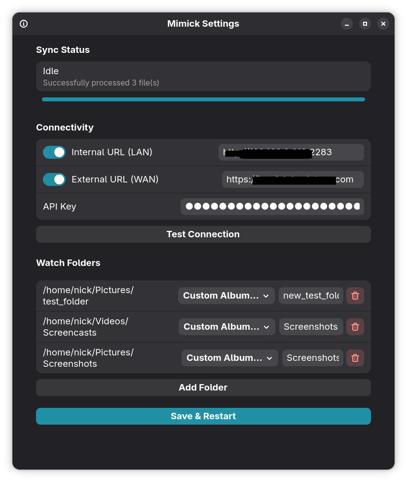

# Mimick for Linux

<div align="center">


[](LICENSE)

</div>


Mimick is a desktop Immich client for Linux, combining a persistent background daemon with a modern GTK4 user interface. It monitors your folders, manages upload queues, and adapts to network and power conditions—all while running unobtrusively in the background. Users can configure, monitor, and control the app in real time via a settings window and system tray icon, making it a seamless and reliable way to sync media to your Immich server from the desktop.

[](https://github.com/nicx17/mimick/wiki/Installation)
[](docs/USER_GUIDE.md)
[](docs/CONFIGURATION.md)
[](docs/TROUBLESHOOTING.md)
[](docs/REPOSITORY_AUTOMATION.md)
[](https://github.com/nicx17/mimick/wiki)

> [!NOTE]
> **This project is in BETA.** Core features are stable and tested. Please report any issues or edge cases you encounter.

**Status:** Beta. Supports Immich v1.118+.

## Screenshots

| Settings Window | System Tray Menu |
| :---: | :---: |
|  |  |
| **Ping Test Dialog** | **About Dialog** |
|  |  |

## Features

- **File Monitoring**: Watches selected folders for new files and waits for stable size before uploading.
- **SHA-1 Checksumming**: Deduplication via checksum before upload — exact same logic as the Immich mobile apps.
- **Concurrent Uploads**: Configurable parallel worker tasks (1–10) stream files directly from disk, keeping RAM usage constant.
- **Offline Reliability**: Failed uploads are persisted to `~/.cache/mimick/retries.json` and replayed automatically on next launch.
- **Queue Inspector & Retry Tools**: Inspect recent queue activity, retry one failed file, retry all failed uploads, or clear the failed queue from the settings window.
- **Batch Notifications**: Receives a single summary notification when a sync cycle completes, replacing per-file spam. Dedicated alerts for connectivity loss help you stay informed without being overwhelmed.
- **Sync Controls**: Pause or resume uploads and trigger a manual `Sync Now` pass from either the tray or the settings window.
- **Connectivity**: Automatically switches between **Internal (LAN)** and **External (WAN)** URLs based on availability. At least one must be enabled (enforced by the UI).
- **Per-Folder Rules**: Each watched folder can optionally ignore hidden paths, cap file size, or allow only selected file extensions.
- **Quiet Hours**: Define a window of time during which uploads should be globally paused to reserve bandwidth or system resources.
- **Diagnostics Export**: Generate a redacted support bundle with queue state, sync summaries, and a human-readable report without exposing raw logs, URLs, or full local paths.
- **Network / Power Awareness**: Optionally defer uploads while on a metered connection or running on battery power.
- **Custom Album Mapping**: Select an existing remote album, type a custom name, or let the app create an album from the local folder name (e.g., `~/Pictures/Vacation 2024` → Album `Vacation 2024`). A searchable modal picker lets you filter albums or create new ones inline.
- **First-Run Wizard**: When no API key is detected, Mimick opens the Setup page automatically with a welcome prompt and keeps "Save & Restart" disabled until credentials are entered, preventing silent connection failures.
- **Health Dashboard & Status**: See global network connectivity and errors on the Controls page, alongside Per-Folder Status showing pending queue size and last sync time directly next to each watched directory.
- **Actionable Errors & Permission Checks**: Emits specific UI warnings instead of generic timeouts, such as alerting you if Flatpak portal access to a watched folder is lost or an API key expires.
- **One-Way Sync**: Uploads media without modifying local files.
- **Security**: API Key stored in the system keyring via `secret-tool` (libsecret).
- **Autostart**: Optional login startup with desktop-portal permission inside Flatpak and native autostart integration outside Flatpak.
- **Startup Catch-Up Controls**: On launch, Mimick scans watched folders for media that has not been synced yet. Users can optimize disk I/O by limiting this scan strictly to recent files (last 7 days) or new files only.
- **Clear Window Controls**: `Close` hides the settings window, while `Quit` stops the app completely.
- **Desktop Integration**:
  - GTK4 / Libadwaita settings UI (dark mode by default).
  - StatusNotifierItem system tray icon (requires AppIndicator support on GNOME).

---

## Installation (Recommended)

The easiest and official way to install Mimick on any Linux distribution is via our Flatpak repository. This ensures you receive automatic updates whenever a new version is released.

Run these commands in your terminal:


# 1. Add the official Mimick repository

```bash
flatpak remote-add --user --if-not-exists mimick-repo https://nicx17.github.io/mimick/mimick.flatpakrepo
```

# 2. Install the application

```bash
flatpak install --user mimick-repo io.github.nicx17.mimick
```

### Verify the Flatpak Repo Key

The published Flatpak repository embeds this signing-key fingerprint:

`04E2 9556 E951 B2EA 15D3 A8EE 632E 1BC5 D956 579C`

You can inspect the currently published key with:

```bash
curl -fsSL https://nicx17.github.io/mimick/mimick.flatpakrepo \
  | sed -n 's/^GPGKey=//p' \
  | base64 -d > /tmp/mimick-repo-public.gpg

gpg --show-keys --fingerprint /tmp/mimick-repo-public.gpg
```

Compare the printed fingerprint to the value above. The email address alone is not the trust anchor; the fingerprint is.
---

## Usage & Configuration

### First Launch

Launch Mimick from your Application Launcher. The settings window opens automatically on first launch.

The window is split into two pages:

* **Setup** for server details, behavior switches, watch folders, and folder rules
* **Controls** for status, queue actions, manual sync, pause/resume, and diagnostics export

1. **Internal URL** — LAN address (e.g., `http://192.168.1.50:2283`).
2. **External URL** — WAN/Public address (e.g., `https://photos.example.com`). *At least one must be enabled.*
3. **API Key** — Generate in Immich Web UI under Account Settings > API Keys. Needs **Asset** and **Album** read/create permissions.
4. **Watch Paths** — Add folders to monitor with the built-in folder picker. Each folder can be assigned a target Immich album.
5. **Run on Startup** — Enable this in the **Behavior** section to start Mimick automatically when you log in.
6. **Folder Rules** — Each watched folder can open a rules dialog to ignore hidden paths, set a max size in MB, or restrict uploads to specific extensions.
7. **Sync Controls** — Use **Pause**, **Resume**, or **Sync Now** from the settings window or tray menu when you want manual control.
8. **Queue Inspector** — Review recent queue events, inspect failed uploads, retry individual files, retry all failures, or clear the failed queue.
9. **Export Diagnostics** — Create a support bundle from the settings window when troubleshooting sync issues.
10. **Save & Restart** — Applies your settings and relaunches Mimick automatically.
11. **Close / Quit** — `Close` hides the settings window and leaves Mimick running; `Quit` fully exits the app.

The bottom footer keeps **Close**, **Quit**, and **Save & Restart** visible even when the page content needs scrolling.

### Autostart

Use the built-in **Run on Startup** switch in the settings window.

* Flatpak builds request background/autostart permission through the desktop portal.
* Native builds write an autostart desktop entry to `~/.config/autostart/io.github.nicx17.mimick.desktop`.

### Folder Access

Mimick now uses selected-folder access instead of full home-directory access in Flatpak.

* Add watch folders from the settings window so the file chooser portal can grant access.
* If you are upgrading from an older build that had full home access, re-add your existing watch folders once so the new permission model can take effect.
* Portal-backed folders may appear by name in the UI and logs instead of showing the raw `/run/user/.../doc/...` sandbox path.

### Existing Files and Album Changes

Mimick does not only sync files created while it is already running.

* On startup, Mimick rescans watched folders and queues media that has not been synced yet.
* A local sync index is used so unchanged files that are already known to be synced are skipped quickly.
* If you change the target Immich album for a watched folder, unchanged files can be reassociated to the new album on the next startup without forcing a full reupload.
* If a previously targeted album was deleted, Mimick refreshes album resolution and recreates or rebinds the target album as needed.

### Quitting vs Closing

Mimick is a background app, so closing the settings window does not quit it.

* Use **Close** in the settings window or the window close button to hide the window and keep Mimick running in the tray.
* Use **Quit** from the tray menu, the settings window, or the launcher action to stop the app completely.

### Queue and Diagnostics Tools

Mimick now includes a small control center for active troubleshooting and recovery.

On the **Controls** page:

* **Sync Now** reruns the watched-folder scan immediately.
* **Pause** toggles upload activity without quitting Mimick.
* **Queue Inspector** shows failed items and recent queue activity from the current session.
* **Retry All Failed** requeues everything currently stored in the failed list.
* **Retry** on a single failed row requeues only that item.
* **Clear Failed Queue** removes persisted failed items you no longer want Mimick to retry.
* **Export Diagnostics** writes a bundle with `summary.txt`, `config.redacted.json`, `status.redacted.json`, `retries.redacted.json`, `synced_index.redacted.json`, and `privacy-note.txt`.

### Network and Power-Aware Behavior

If enabled in the **Behavior** section, Mimick can pause uploads automatically:

* on metered connections, detected best-effort via `nmcli`
* while running on battery power, detected best-effort from `/sys/class/power_supply`

These options defer uploads rather than changing your watch configuration, so syncing resumes when conditions improve or when you manually resume.

---

## Building from Source (For Developers)

If you prefer to compile Mimick yourself, you can build it natively or package it as a local Flatpak.

### Prerequisites (Native Build)

* Rust toolchain (`cargo`): https://rustup.rs
* GTK4 + Libadwaita development headers

**Ubuntu / Debian:**

```bash
sudo apt install libgtk-4-dev libadwaita-1-dev libglib2.0-dev pkg-config build-essential libsecret-1-dev

```

**Fedora:**

```bash
sudo dnf install gtk4-devel libadwaita-devel libsecret-devel pkg-config

```

**Arch Linux:**

```bash
sudo pacman -S gtk4 libadwaita libsecret pkgconf base-devel

```

### Native Rust Build

```bash
git clone https://github.com/nicx17/mimick.git
cd mimick
cargo build --release
# Copy the desktop file and icons from setup/ to ~/.local/share/applications and ~/.local/share/icons for launcher integration

# Run Directly
cargo run                   # start in background mode
cargo run -- --settings     # open the settings window immediately

```

Logs written to the terminal and to `~/.cache/mimick/mimick.log` now include timestamps.

### Local Flatpak Build

```bash
git clone https://github.com/nicx17/mimick.git
cd mimick
flatpak-builder --user --install --force-clean build-dir io.github.nicx17.mimick.local.yml
flatpak run io.github.nicx17.mimick

```

---

## Documentation

[](https://github.com/nicx17/mimick/wiki)
[](https://github.com/nicx17/mimick/wiki/Installation)
[](docs/USER_GUIDE.md)
[](docs/CONFIGURATION.md)
[](docs/DEVELOPMENT.md)
[](docs/TESTING.md)
[](docs/TROUBLESHOOTING.md)
[](docs/REPOSITORY_AUTOMATION.md)
[](SECURITY.md)

## Trust and Verification

Mimick currently publishes a few concrete trust signals:

- signed Flatpak repository metadata
- GitHub release assets with checksums
- CodeQL analysis in GitHub Actions
- CI checks for formatting, linting, tests, and dependency audits

If you install via Flatpak, verify the published signing fingerprint before trusting the repo:

`04E2 9556 E951 B2EA 15D3 A8EE 632E 1BC5 D956 579C`

## Contributing

Pull requests are welcome. See `CONTRIBUTING.md` for commit and style guidelines.

## Acknowledgments

* Application icon illustration by Round Icons on Unsplash.

## License

GNU General Public License v3.0 — see [LICENSE](LICENSE).
