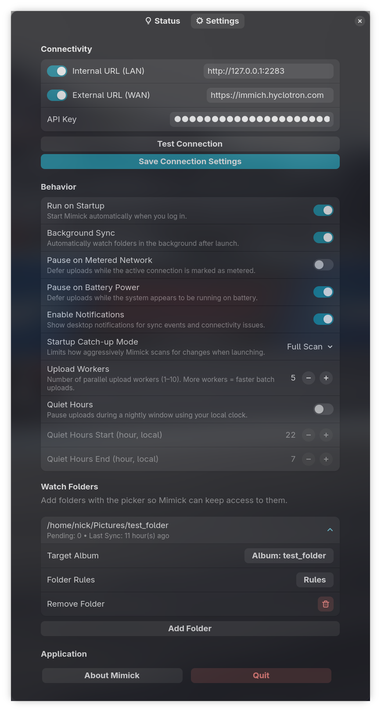
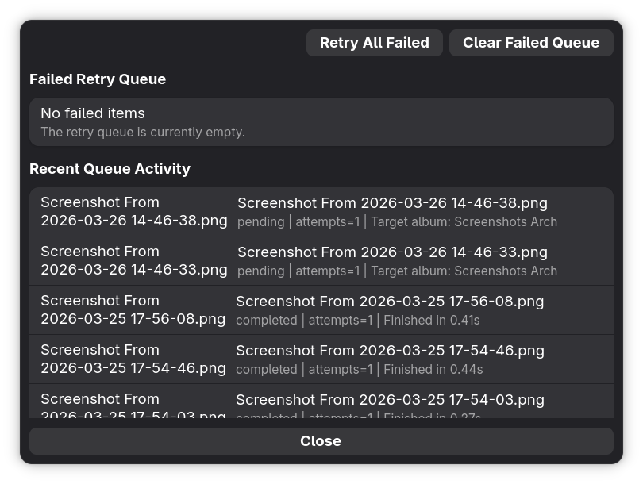

# Mimick - Immich Desktop Client for Linux

<div align="center">


[](https://github.com/nicx17/mimick/releases/latest)
[](https://github.com/rust-lang/rust)
[](https://github.com/torvalds/linux)
[](https://gitlab.gnome.org/GNOME/gtk)
[](LICENSE)

</div>


Mimick is an Immich desktop client for Linux. It provides a GTK4/libadwaita GUI for syncing local photo and video folders to a self-hosted Immich server, with background folder watching, tray controls, retries, diagnostics, and per-folder album rules.

Use Mimick as a native Linux GUI for Immich when you want your desktop folders to upload automatically without running a manual script or keeping a browser open.

<div align="center">

[](https://github.com/nicx17/mimick/wiki/Installation)
[](wiki/Configuration-and-First-Run.md)
[](wiki/Home.md)
[](wiki/Troubleshooting.md)
[](https://github.com/nicx17/mimick/wiki)


</div>

**Status:** Supports Immich v1.118+.

## Screenshots

| Settings Window | Status page |
| :---: | :---: |
|  |  |
| **Queue Inspector** | **About Dialog** |
|  |  |
| **Ping Test Dialog** | **Tray Icon** |
|  |  |


## Core Architecture & Features

### Sync Engine
- **Asynchronous Concurrent Uploads**: Configurable parallel worker tasks (1–10 streams) stream files from disk, maintaining flat memory usage footprints.
- **SHA-1 Deduplication**: Verifies files locally via checksum prior to upload, utilizing payload logic identical to official Immich mobile apps.
- **Atomic File Monitoring**: Delays queuing until file sizes stabilize and physical write locks are released, preventing partial data uploads.
- **One-Way Mirroring**: Maintains strictly read-only access to local system files.

### Reliability & State Management
- **Persistent Offline Storage**: Upload network failures are safely serialized to disk (`~/.cache/mimick/retries.json`) and gracefully replayed during subsequent daemon lifecycles.
- **Local State Indexing**: Unmodified, previously uploaded media is aggressively skipped during startup catch-up scans using local indexes to minimize disk I/O overhead.
- **Queue Inspector**: Interactive UI module to interpret active error payloads, selectively retry specific dropped files, or flush the active failure queue.
- **Dynamic Endpoint Resolution**: Automatically negotiates requests between configured Internal (LAN) and External (WAN) URI addresses based on immediate network topologies and heartbeat reachability.

### Environment & Desktop Integration
- **Native Implementation**: Developed purely in Rust, utilizing GTK4 and Libadwaita bindings alongside an AppIndicator system tray for headless daemon control.
- **Hardware Awareness**: Integrates with `nmcli` and `/sys/class/power_supply` to identify running states and optionally defer daemon I/O operations strictly during explicitly metered networks or active battery deployments.
- **Sandbox Security**: Employs Flatpak desktop portal file-choosers to grant the application isolated, per-directory access without requesting system-wide filesystem permissons.
- **Encrypted Keystore**: API keys are stored securely via the [oo7](https://github.com/linux-credentials/oo7) keyring library. Inside Flatpak, credentials are kept in a portal-encrypted file within the sandbox. On native installs, the desktop's Secret Service (GNOME Keyring, KWallet) is used.
- **Quiet Hours**: Configurable chronological barriers to globally suspend daemon uploads.

### Directory Scoping & Filtering
Each watched directory operates with isolated logical constraints:
- Static or dynamically generated Immich album targets.
- Pre-flight omission of hidden paths (dotfiles).
- Predetermined allowance lists strictly for explicit file extensions (e.g. `.avif`, `.mp4`).
- Upper-bound maximum file size ceilings.

### Library View (Optional)
- Built-in album browser with thumbnail grid and Explore landing page.
- Search modes: filename/metadata, Smart (CLIP), and OCR text lookup.
- Download originals and open full-resolution previews in the lightbox.
- Toggle via **Settings → Behavior → Enable Library View** (restart required).

---

## Installation (Recommended)

The easiest and official way to install Mimick on any Linux distribution is via our Flatpak repository. This ensures you receive automatic updates whenever a new version is released.

**Prerequisites**: Flatpak must be installed and the [Flathub](https://flathub.org/setup) remote must be configured on your system (required for GNOME runtime dependencies).

### Graphical Install (One-Click)

You can easily install Mimick by downloading and opening the `.flatpakref` file. Your system's software center (like GNOME Software or KDE Discover) should open it and handle adding the repository and installing the app automatically:

[Download mimick.flatpakref](https://mimick.nicx.dev/mimick.flatpakref)

### Command Line Install

Alternatively, install using the terminal. You can install directly via the `.flatpakref`:

```bash
flatpak install --user https://mimick.nicx.dev/mimick/mimick.flatpakref
```

Or by adding the repository manually:

```bash
# Add the official Mimick repository
flatpak remote-add --user --if-not-exists mimick-repo https://mimick.nicx.dev/mimick/mimick.flatpakrepo

# Install the application
flatpak install --user mimick-repo dev.nicx.mimick
```

*Note: If Flatpak fails to install due to a missing `runtime/org.gnome.Platform`, ensure that you have the [Flathub](https://flathub.org/setup) remote configured on your system.*

### Verify the Flatpak Repo Key

The published Flatpak repository embeds this signing-key fingerprint:

`04E2 9556 E951 B2EA 15D3 A8EE 632E 1BC5 D956 579C`

You can inspect the currently published key with:

```bash
curl -fsSL https://mimick.nicx.dev/mimick/mimick.flatpakrepo \
  | sed -n 's/^GPGKey=//p' \
  | base64 -d > /tmp/mimick-repo-public.gpg

gpg --show-keys --fingerprint /tmp/mimick-repo-public.gpg
```

Compare the printed fingerprint to the value above. The email address alone is not the trust anchor; the fingerprint is.
---

## Usage & Configuration

### First Launch

Launch Mimick from your Application Launcher. The settings window opens automatically on first launch.

The window is split into two pages:

* **Settings** for server details, behavior switches, watch folders, and folder rules
* **Status** for sync health, queue actions, manual sync, pause/resume, and diagnostics export

The UI is fully responsive and automatically adapts its layout for narrow widths (sub-360px), making it compatible with mobile Linux devices.

1. **Internal URL** — LAN address (e.g., `http://192.168.1.50:2283`).
2. **External URL** — WAN/Public address (e.g., `https://photos.example.com`). *At least one must be enabled.*
3. **API Key** — Generate in Immich Web UI under Account Settings > API Keys. Needs **Asset** read/create/update/download permissions and **Album** read/create/update permissions.
4. **Watch Paths** — Add folders to monitor with the built-in folder picker. Each folder can be assigned a target Immich album.
5. **Run on Startup** — Enable this in the **Behavior** section to start Mimick automatically when you log in.
6. **Folder Rules** — Each watched folder can open a rules dialog to ignore hidden paths, set a max size in MB, or restrict uploads to specific extensions.
7. **Sync Controls** — Use **Pause**, **Resume**, or **Sync Now** from the settings window or tray menu when you want manual control.
8. **Queue Inspector** — Review recent queue events, inspect failed uploads, retry individual files, retry all failures, or clear the failed queue.
9. **Export Diagnostics** — Create a support bundle from the settings window when troubleshooting sync issues.
10. **Save Changes** — Applies your settings immediately without relaunching Mimick.
11. **Close / Quit** — `Close` hides the settings window and leaves Mimick running; `Quit` fully exits the app.

The bottom footer keeps **Close**, **Quit**, and **Save Changes** visible even when the page content needs scrolling.

### Autostart

Use the built-in **Run on Startup** switch in the settings window.

* Flatpak builds request background/autostart permission through the desktop portal.
* Native builds write an autostart desktop entry to `~/.config/autostart/dev.nicx.mimick.desktop`.

### Folder Access

Mimick now uses selected-folder access instead of full home-directory access in Flatpak.

* Add watch folders from the settings window so the file chooser portal can grant access.
* If you are upgrading from an older build that had full home access, re-add your existing watch folders once so the new permission model can take effect.
* Portal-backed folders may appear by name in the UI and logs instead of showing the raw `/run/user/.../doc/...` sandbox path.

### Existing Files and Album Changes

Mimick does not only sync files created while it is already running.

* On startup, Mimick rescans watched folders and queues media that has not been synced yet.
* A local sync index is used so unchanged files that are already known to be synced are skipped quickly.
* If you change the target Immich album for a watched folder, unchanged files can be reassociated to the new album on the next startup without forcing a full reupload.
* If a previously targeted album was deleted, Mimick refreshes album resolution and recreates or rebinds the target album as needed.

### Quitting vs Closing

Mimick is a background app, so closing the settings window does not quit it.

* Use **Close** in the settings window or the window close button to hide the window and keep Mimick running in the tray.
* Use **Quit** from the tray menu, the settings window, or the launcher action to stop the app completely.

### Queue and Diagnostics Tools

Mimick now includes a small control center for active troubleshooting and recovery.

On the **Status** page:

* **Sync Now** reruns the watched-folder scan immediately.
* **Pause** toggles upload activity without quitting Mimick.
* **Queue Inspector** shows failed items and recent queue activity from the current session.
* **Retry All Failed** requeues everything currently stored in the failed list.
* **Retry** on a single failed row requeues only that item.
* **Clear Failed Queue** removes persisted failed items you no longer want Mimick to retry.
* **Export Diagnostics** writes a bundle with `summary.txt`, `config.redacted.json`, `status.redacted.json`, `retries.redacted.json`, `synced_index.redacted.json`, and `privacy-note.txt`.

### Network and Power-Aware Behavior

If enabled in the **Behavior** section, Mimick can pause uploads automatically:

* on metered connections, detected best-effort via `nmcli`
* while running on battery power, detected best-effort from `/sys/class/power_supply`

These options defer uploads rather than changing your watch configuration, so syncing resumes when conditions improve or when you manually resume.

---

## Building from Source (For Developers)

If you prefer to compile Mimick yourself, you can build it natively or package it as a local Flatpak.

### Prerequisites (Native Build)

* Rust toolchain (`cargo`): https://rustup.rs
* GTK4 + Libadwaita development headers

**Ubuntu / Debian:**

```bash
sudo apt install libgtk-4-dev libadwaita-1-dev libglib2.0-dev pkg-config build-essential

```

**Fedora:**

```bash
sudo dnf install gtk4-devel libadwaita-devel pkg-config

```

**Arch Linux:**

```bash
sudo pacman -S gtk4 libadwaita pkgconf base-devel

```

### Native Rust Build

```bash
git clone https://github.com/nicx17/mimick.git
cd mimick
cargo build --release
# Copy the desktop file and icons from setup/ to ~/.local/share/applications and ~/.local/share/icons for launcher integration

# Run Directly
cargo run                   # start in background mode
cargo run -- --settings     # open the settings window immediately

```

Logs written to the terminal and to `~/.cache/mimick/mimick.log` include timestamps.
Terminal logs are colorized by level, and file logs rotate automatically.

## Logging & Notifications

- **Logging**: Mimick now uses a colored console formatter for human-friendly terminal output and a plain file formatter for persistent logs. File logs are rotated automatically (approx. 2 MB per file; 5 files kept). Control verbosity with `RUST_LOG` (for example: `RUST_LOG=debug`). See [wiki/Development.md](wiki/Development.md) for details on the logger configuration.

- **Notifications**: To reduce notification spam, Mimick aggregates multiple worker uploads into a single batch summary notification when a sync cycle completes. A separate "Connection Lost" notification is still emitted for connectivity failure events.

### Settings behavior

- Most settings (worker count, quiet hours, folder rules, per-folder album, watch-folder additions/removals) are applied live when changed in the Settings window.
- Connectivity edits (API key and server URLs) are intentionally save-only and require clicking **Save** within the Connectivity group to take effect. This reduces accidental partial-configuration of server credentials during exploratory edits.

### Local Flatpak Build

```bash
git clone https://github.com/nicx17/mimick.git
cd mimick
flatpak-builder --user --install --force-clean build-dir dev.nicx.mimick.local.yml
flatpak run dev.nicx.mimick

```

---

## Documentation

<div align="center">

[](https://github.com/nicx17/mimick/wiki)
[](https://github.com/nicx17/mimick/wiki/Installation)
[](wiki/Configuration-and-First-Run.md)
[](wiki/Home.md)
[](wiki/Development.md)
[](wiki/Testing.md)
[](wiki/Troubleshooting.md)
[](SECURITY.md)

</div>

## Trust and Verification

Mimick currently publishes a few concrete trust signals:

- signed Flatpak repository metadata
- GitHub release assets with checksums
- CodeQL analysis in GitHub Actions
- CI checks for formatting, linting, tests, and dependency audits

If you install via Flatpak, verify the published signing fingerprint before trusting the repo:

`04E2 9556 E951 B2EA 15D3 A8EE 632E 1BC5 D956 579C`

## Contributing

Pull requests are welcome. See `CONTRIBUTING.md` for commit and style guidelines.

## Acknowledgments

* Application icon illustration by Round Icons on Unsplash.

## License

GNU General Public License v3.0 — see [LICENSE](LICENSE).
