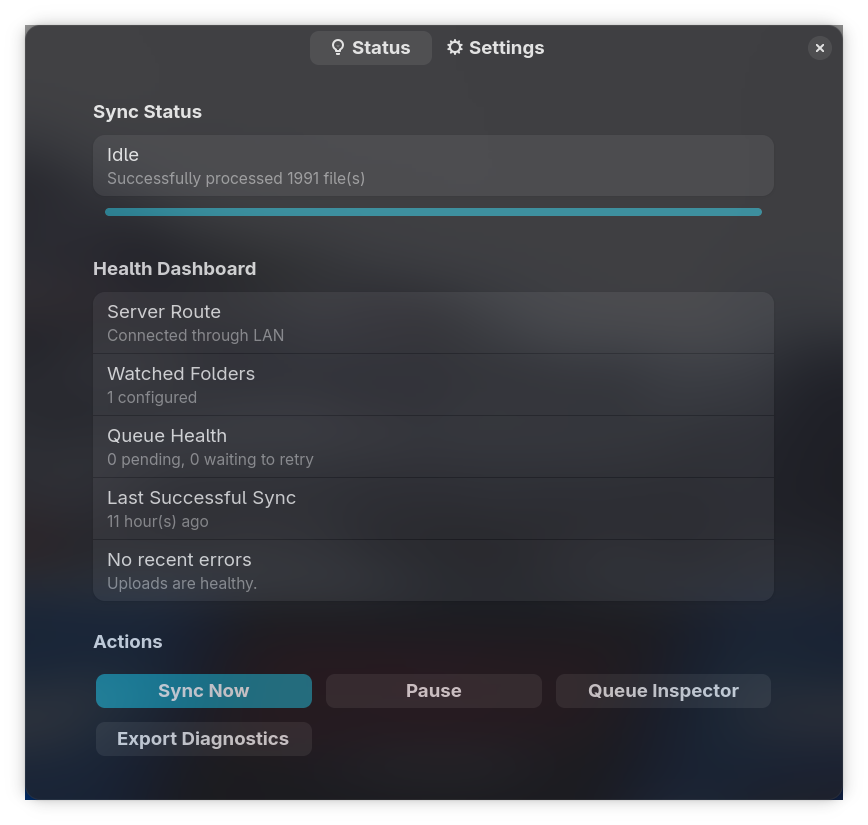

# Configuration and First Run

## First Launch

On first launch, open the settings window and work through the `Setup` page:

1. `Internal URL` for LAN access to Immich.
2. `External URL` for WAN access to Immich.
3. An Immich API key.
4. One or more watch folders.
5. Optional behavior switches such as `Run on Startup`, `Pause on Metered Network`, and `Pause on Battery Power`.

At least one URL must stay enabled.

The `Controls` page is for live actions after setup, including `Sync Now`, `Pause / Resume`, `Queue Inspector`, and `Export Diagnostics`.

> **System Tray Integration**
> Below is how Mimick integrates into your desktop environment.
> 

## Watch Folders

Each watch folder can:

- sync into an existing album
- create a new album from a custom name
- use the folder name as the default album name
- apply per-folder rules for hidden paths, file extensions, and maximum file size

Flatpak builds only gain access to folders selected through the built-in picker.

## Run on Startup

Mimick can register itself to launch after login:

- Flatpak builds use the desktop background portal.
- Native builds create `~/.config/autostart/io.github.nicx17.mimick.desktop`.

## Save, Close, Quit

- `Save & Restart` writes the config and relaunches Mimick so watcher and connectivity changes take effect immediately.
- `Close` hides the settings window but keeps Mimick running.
- `Quit` exits the whole app.

The window close button behaves the same as `Close`.

## Config File

The main config file is:

`~/.config/mimick/config.json`

Important keys:

- `watch_paths`
- `internal_url`
- `external_url`
- `internal_url_enabled`
- `external_url_enabled`
- `run_on_startup`
- `pause_on_metered_network`
- `pause_on_battery_power`

The API key is stored in the system keyring, not in `config.json`.
